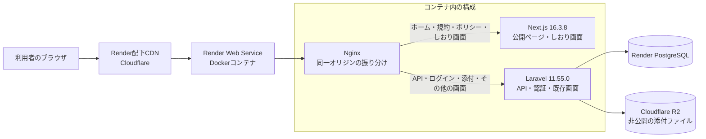
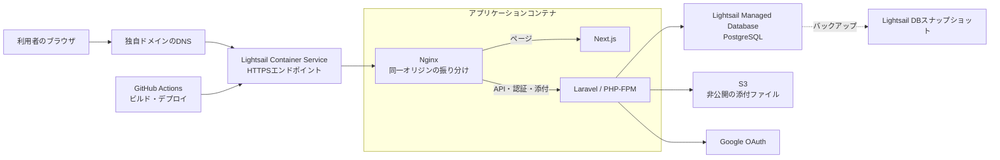

# PLAGINE｜旅のしおり

旅の予定、持ち物、お土産、メモをひとつのしおりにまとめ、メンバーと一緒に準備できるWebアプリです。

**公開URL:** [https://guide-2s9j.onrender.com](https://guide-2s9j.onrender.com)

  
  
  
  

## 目次

- [PLAGINE｜旅のしおり](#plagine旅のしおり)
  - [目次](#目次)
  - [開発背景](#開発背景)
  - [主な機能](#主な機能)
  - [機能ごとの説明](#機能ごとの説明)
  - [現行アーキテクチャ](#現行アーキテクチャ)
  - [公開アプリの技術構成](#公開アプリの技術構成)
  - [今後の実装方針：Lightsailへ移行](#今後の実装方針lightsailへ移行)
    - [Lightsail移行後のアーキテクチャ案](#lightsail移行後のアーキテクチャ案)

## 開発背景

旅の計画や準備の情報を一か所にまとめ、同行者と共有しながら、旅の前から当日まで使えるしおりを作ることを目指しています。

## 主な機能

- 🗺️ 日付・時刻・場所・写真を使った旅程の作成と並べ替え
- 🎒 個人用の持ち物リストと国内・海外旅行向けテンプレート
- 🎁 メンバーと共有するお土産リスト
- 📝 旅の情報を共有するメモ
- 👥 編集メンバーの招待と共同編集
- 🔗 パスワード付き閲覧リンクの発行
- 📎 JPEG、PNG、PDF、Wordファイルの添付（1ファイル10 MBまで）
- 🔐 Googleアカウントでのログイン

持ち物は利用者ごとに管理し、旅程・お土産・メモはしおりのメンバー間で共有します。

## 機能ごとの説明

各機能の画面を後から掲載できるよう、スクリーンショット欄を用意しています。持ち物リストには公開ページのモックアップを掲載しています。

### 🗺️ 旅程の作成・編集

旅行の日程ごとに予定を追加し、時間・場所・内容・写真をまとめて管理できます。予定はドラッグ操作で並べ替え、メンバーと共有できます。

> **スクリーンショット欄:** `docs/screenshots/itinerary.png`（画像追加予定）

### 🎒 持ち物リスト

自分専用の持ち物チェックリストを作成できます。国内・海外旅行向けのテンプレートから項目を追加し、準備状況をチェックしたり、順番を並べ替えたりできます。

  

### 🎁 お土産リスト

買いたいものや購入状況を記録し、旅のメンバーと共有できます。

> **スクリーンショット欄:** `docs/screenshots/souvenirs.png`（画像追加予定）

### 📝 メモ

旅先で確認したい情報や、メンバーに伝えたい内容をしおり内に残せます。

> **スクリーンショット欄:** `docs/screenshots/notes.png`（画像追加予定）

### 👥 メンバーとの共同編集

メンバーを編集者として招待し、旅程・お土産・メモを一緒に更新できます。持ち物リストは利用者ごとに分かれているため、自分の準備状況を管理できます。

> **スクリーンショット欄:** `docs/screenshots/members.png`（画像追加予定）

### 🔗 閲覧リンクでの共有

閲覧用リンクを発行して、編集権限を持たない相手にも旅のしおりを共有できます。リンクにはパスワードと有効期限を設定でき、必要に応じて停止できます。

> **スクリーンショット欄:** `docs/screenshots/shared-access.png`（画像追加予定）

### 📎 ファイル添付

予約確認書などの資料をJPEG、PNG、PDF、Word形式で添付できます。1ファイルあたりの上限は10 MBです。

> **スクリーンショット欄:** `docs/screenshots/attachments.png`（画像追加予定）

### 🔐 Googleログイン

Googleアカウントでログインして、自分のしおりを作成・編集できます。

> **スクリーンショット欄:** `docs/screenshots/login.png`（画像追加予定）

## 現行アーキテクチャ

公開URLはRender配下のCloudflare CDNを経由してRenderへ到達します。Renderのデプロイ設定と稼働中のソース構成をもとにしています。NginxはページをNext.jsへ、API・認証・添付の処理やその他の画面をLaravelへ振り分けます。両者を同じ公開オリジンに置くことで、LaravelのセッションとCSRF Cookieを共有します。Cloudflare R2は添付ファイルの保存先で、CDNとは別の役割です。

## 公開アプリの技術構成

| 分類 | 技術・構成 | バージョン |
| --- | --- | --- |
| フロントエンド | Next.js、React、TypeScript | 16.3.8、19.3.0、5.9.3 |
| バックエンド | Laravel、PHP | 11.55.0、8.3 |
| Webサーバー | Nginx | Render用Dockerイメージに同梱 |
| データベース | PostgreSQL | Renderマネージドデータベース |
| 添付ファイル | Cloudflare R2 | 非公開バケット |
| ホスティング・エッジ | Render、Cloudflare | Web Service・エッジ配信 |

## 今後の実装方針：Lightsailへ移行

現行の同一オリジン構成を保ったまま、Next.jsとLaravelを含むアプリケーションをコンテナ化してLightsail Container Serviceで配信する案です。旅程などの永続データはLightsailのマネージドPostgreSQLへ、添付ファイルはコンテナ外の非公開S3バケットへ保存します。コンテナとデータベースは同じAWSリージョンに配置します。

### Lightsail移行後のアーキテクチャ案

Lightsail Container Serviceは公開エンドポイントでHTTPSを提供し、カスタムドメインと証明書を設定できます。LightsailのコンテナサービスからLightsailデータベースへ接続する構成もサポートされています。[コンテナサービスの公開エンドポイント](https://docs.aws.amazon.com/lightsail/latest/userguide/amazon-lightsail-container-services-deployments.html) · [コンテナサービスとデータベースの接続](https://docs.aws.amazon.com/lightsail/latest/userguide/amazon-lightsail-connecting-container-service-to-database.html) · [カスタムドメインの証明書](https://docs.aws.amazon.com/lightsail/latest/userguide/amazon-lightsail-creating-container-services-certificates.html)
