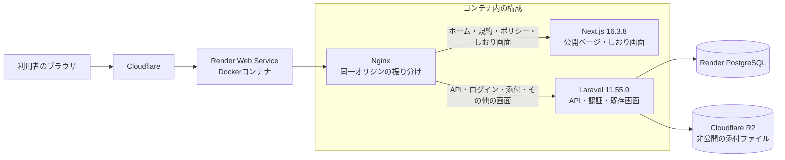
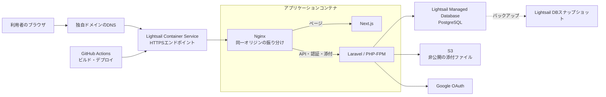

# PLAGINE｜旅のしおり

旅の予定、持ち物、お土産、メモをひとつのしおりにまとめ、メンバーと一緒に準備できるWebアプリです。

**公開URL:** [https://guide-2s9j.onrender.com](https://guide-2s9j.onrender.com)

## 目次

- [PLAGINE｜旅のしおり](#plagine旅のしおり)
  - [目次](#目次)
  - [開発背景](#開発背景)
  - [主な機能](#主な機能)
  - [機能ごとの説明](#機能ごとの説明)
  - [設計上の工夫](#設計上の工夫)
  - [画面イメージ](#画面イメージ)
    - [現行アーキテクチャ](#現行アーキテクチャ)
    - [公開アプリの技術構成](#公開アプリの技術構成)
  - [今後の実装方針：Lightsailへ移行](#今後の実装方針lightsailへ移行)
    - [Lightsail移行後のアーキテクチャ案](#lightsail移行後のアーキテクチャ案)

## 開発背景

旅の計画や準備の情報を一か所にまとめ、同行者と共有しながら、旅の前から当日まで使えるしおりを作ることを目指しています。

## 主な機能

- 日付・時刻ごとの旅程作成
- 持ち物・お土産のチェックリスト
- 旅程や持ち物などの並べ替え
- メンバーとの共同編集
- パスワード付き閲覧リンクでの共有
- JPEG、PNG、PDF、Wordファイルの添付（1ファイル10 MBまで）

持ち物は利用者ごとに管理し、旅程・お土産・メモはしおりのメンバー間で共有します。

## 機能ごとの説明

- **旅程:** 日付、時間、場所、写真を使って予定を組み立て、旅の流れをメンバーと共有します。
- **持ち物:** 自分用のチェックリストを作成し、国内・海外旅行向けのテンプレートから準備を始められます。
- **お土産:** 買いたいものをリスト化し、準備中に確認できます。
- **共同編集・共有:** メンバーを編集者として招待できます。閲覧用リンクにはパスワードを設定できます。
- **ファイル添付:** JPEG、PNG、PDF、Word形式の資料を、1ファイル10 MBまで添付できます。
- **Googleログイン:** Googleアカウントでログインして、しおりを作成・編集できます。

## 設計上の工夫

- 持ち物リストは利用者ごとに分け、旅程・お土産・メモはメンバー間で共有します。
- 編集メンバーと閲覧リンクの利用者を分け、閲覧リンクにはパスワードを設定できます。

## 画面イメージ

公開ページに掲載されている持ち物リストの画面イメージです。公開ページから確認できる機能画面の画像は現在この1枚です。

  

### 現行アーキテクチャ

Renderのデプロイ設定と稼働中のソース構成をもとにしています。NginxはページをNext.jsへ、API・認証・添付の処理やその他の画面をLaravelへ振り分けます。両者を同じ公開オリジンに置くことで、LaravelのセッションとCSRF Cookieを共有します。

### 公開アプリの技術構成

| 分類 | 技術・構成 | バージョン |
| --- | --- | --- |
| フロントエンド | Next.js、React、TypeScript | 16.3.8、19.3.0、5.9.3 |
| バックエンド | Laravel、PHP | 11.55.0、8.3 |
| Webサーバー | Nginx | Render用Dockerイメージに同梱 |
| データベース | PostgreSQL | Renderマネージドデータベース |
| 添付ファイル | Cloudflare R2 | 非公開バケット |
| ホスティング・エッジ | Render、Cloudflare | Web Service・エッジ配信 |

## 今後の実装方針：Lightsailへ移行

現行の同一オリジン構成を保ったまま、Next.jsとLaravelを含むアプリケーションをコンテナ化してLightsail Container Serviceで配信する案です。旅程などの永続データはLightsailのマネージドPostgreSQLへ、添付ファイルはコンテナ外の非公開S3バケットへ保存します。コンテナとデータベースは同じAWSリージョンに配置します。

### Lightsail移行後のアーキテクチャ案

Lightsail Container Serviceは公開エンドポイントでHTTPSを提供し、カスタムドメインと証明書を設定できます。LightsailのコンテナサービスからLightsailデータベースへ接続する構成もサポートされています。[コンテナサービスの公開エンドポイント](https://docs.aws.amazon.com/lightsail/latest/userguide/amazon-lightsail-container-services-deployments.html) · [コンテナサービスとデータベースの接続](https://docs.aws.amazon.com/lightsail/latest/userguide/amazon-lightsail-connecting-container-service-to-database.html) · [カスタムドメインの証明書](https://docs.aws.amazon.com/lightsail/latest/userguide/amazon-lightsail-creating-container-services-certificates.html)
