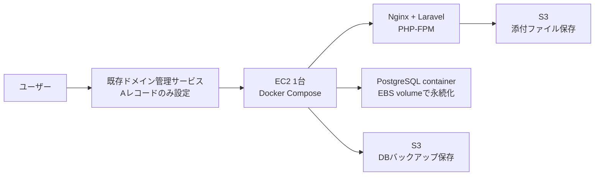

# AWS構築計画

## 方針

最初のAWS構成は、低コストを優先して `EC2 1台 + Docker Compose + PostgreSQL + S3` で始める。
ドメインはAWSへ移管せず、既存のドメイン管理サービスでDNSレコードだけをEC2へ向ける。

この構成はフルマネージドではないため、OS更新、バックアップ、障害復旧は自分で管理する。
一方で、App Runner、ECS Fargate、RDS、ALBを最初から使う構成より月額費用を抑えやすい。

## 全体構成



## 採用するAWSサービス

- `EC2`: アプリ、Nginx、PostgreSQLをDocker Composeで動かす。
- `EBS`: PostgreSQLのデータ領域を永続化する。
- `S3`: 添付ファイルとDBバックアップを保存する。
- `IAM`: EC2からS3へアクセスする権限を付与する。
- `Security Group`: `22`, `80`, `443` のみを公開する。

## CDK方針

低コストを優先するため、新規VPC、NAT Gateway、ALB、RDS、Route 53 hosted zoneは作成しない。
`infra/` 配下にTypeScript CDKプロジェクトを追加する。

### 作成するリソース

| リソース | 詳細 |
|---------|------|
| Security Group | 22(SSH/自分のIPのみ), 80(HTTP), 443(HTTPS) |
| IAM Role + Instance Profile | S3の2バケットへの最小権限 |
| EC2 | t4g.small, Ubuntu LTS ARM, EBS gp3 20GB |
| Elastic IP | EC2に自動アタッチ |
| S3: `guide-production-files` | アプリ添付ファイル用、Public Access Block有効 |
| S3: `guide-production-backups` | PostgreSQLバックアップ用、Public Access Block有効、7日で自動削除 |

### User Dataで自動インストール

`cdk deploy` 完了後にEC2へSSHできる状態にするため、以下をUser Dataで自動セットアップする。

- Docker
- Docker Compose v2
- Git
- AWS CLI v2

### パラメータ

デフォルトVPCを使うため、VPC IDとsubnet IDの指定は不要。
EC2 key pairはCDKで作成し、秘密鍵はSSM Parameter Storeに保存される。
リージョンは `ap-northeast-1`（東京）固定。

必要な入力は `allowedSshCidr` のみ。`infra/cdk.json` の `context` に記載する。

```json
{
  "context": {
    "allowedSshCidr": "x.x.x.x/32"
  }
}
```

`allowedSshCidr` に本物のIPを入れた場合はコミット前に確認する。

### ディレクトリ構成

```
infra/
├── bin/
│   └── infra.ts
├── lib/
│   └── guide-stack.ts
├── cdk.json
├── package.json
└── tsconfig.json
```

### コスト概算（東京リージョン）

| リソース | 月額目安 |
|---------|---------|
| EC2 t4g.small | ~$20 |
| EBS gp3 20GB | ~$2 |
| Elastic IP（EC2稼働中） | $0 |
| S3（小規模） | ~$0.5 |
| **合計** | **~$22/月** |

EC2停止中はElastic IPが課金対象（$0.005/時間）になるため、長期停止時はIPを解放するか終了する。

## ドメイン方針

ドメインはAWSへ移管しない。
既存のドメイン管理サービスで以下のDNS設定を行う。

```text
Aレコード: example.com -> EC2のElastic IP
CNAME: www.example.com -> example.com
```

EC2のPublic IPは停止・開始で変わる可能性があるため、実運用ではElastic IPを使う。
ただしPublic IPv4やElastic IPは課金対象になり得るため、検証時は起動時間と未使用IPに注意する。

## HTTPS方針

HTTPSはEC2上のNginxとCertbotで設定する。
ドメインがあればLet's Encryptで無料のTLS証明書を取得できる。

本番環境では以下を必須にする。

```env
APP_URL=https://example.com
APP_ENV=production
APP_DEBUG=false
SESSION_SECURE_COOKIE=true
```

ドメインなしのPublic IP運用は検証用途に限る。
HTTP運用ではログイン情報、セッションCookie、共有パスワード、添付ファイルURLの扱いが弱くなるため、本番公開には使わない。

## EC2構成

推奨の初期構成は以下。

- インスタンス: `t4g.small` または `t3.small`
- OS: Ubuntu LTS
- ストレージ: EBS `gp3`
- 公開ポート: `22`, `80`, `443`
- アプリ起動: Docker Compose

`t4g.micro` や `t3.micro` でも起動確認はできるが、Laravel、Nodeビルド、PostgreSQLを同居させると余裕が少ない。
最初は `small` で構築し、負荷が低ければ後で縮小する。

## 本番Docker Compose方針

本番用に `docker-compose.prod.yml` を用意する。
開発用のMailpit、Selenium、Meilisearch、Adminerは本番では起動しない。

本番で必要なサービスは以下。

- `app`: Laravel + Nginx/PHP-FPM
- `postgres`: PostgreSQL
- `redis`: 必要になった時だけ追加

PostgreSQLのデータはnamed volumeまたはホスト上の専用ディレクトリに保存し、EBSに残るようにする。

## 環境変数

本番用 `.env` はEC2上に配置し、Git管理しない。

```env
APP_NAME=PLAGINE
APP_ENV=production
APP_KEY=base64:...
APP_DEBUG=false
APP_URL=https://example.com
APP_TIMEZONE=Asia/Tokyo

DB_CONNECTION=pgsql
DB_HOST=postgres
DB_PORT=5432
DB_DATABASE=guide
DB_USERNAME=guide
DB_PASSWORD=strong-password

SESSION_DRIVER=database
SESSION_SECURE_COOKIE=true
CACHE_STORE=database
QUEUE_CONNECTION=database

FILESYSTEM_DISK=local
FILESYSTEM_UPLOADS_DISK=s3
FILESYSTEM_TEMPORARY_URL_TTL=10
AWS_DEFAULT_REGION=ap-northeast-1
AWS_BUCKET=guide-production-files
AWS_USE_PATH_STYLE_ENDPOINT=false

LOG_CHANNEL=stderr
MAIL_MAILER=log
```

`APP_KEY`, `DB_PASSWORD`, AWS認証情報は漏らさない。
EC2にIAM Roleを付ける場合、S3アクセスキーを `.env` に置かず、Roleの権限でS3へアクセスする。

## S3方針

添付ファイルはS3へ保存する。
コンテナやEC2ローカルに添付ファイルを保存すると、再構築、ディスク障害、バックアップ漏れで失う可能性がある。

必要な作業:

- S3 bucketを作成する。
- bucketのPublic Access Blockは有効にする。
- Laravelからは署名付きURL、またはアプリ経由のダウンロードを使う。
- EC2 IAM Roleに対象bucketへの最小権限を付与する。

実装済みのコード対応:

- `FILESYSTEM_UPLOADS_DISK=s3` で添付ファイルをS3へ保存する。
- Laravel S3ドライバ用に `league/flysystem-aws-s3-v3` を使う。
- S3 bucketは非公開にし、ファイル表示時は一時URLを発行する。

## バックアップ方針

RDSを使わないため、PostgreSQLバックアップは必須。
最低限、毎日 `pg_dump` をS3へ保存する。

手動実行:

```bash
./scripts/backup-postgres.sh
```

通常デプロイでは、マイグレーション前に同じスクリプトが自動実行される。
毎日のバックアップはEC2のcronから実行する。

```cron
0 3 * * * cd /home/ubuntu/guide && ./scripts/backup-postgres.sh >> /var/log/guide-backup.log 2>&1
```

バックアップは「取る」だけでは不十分。
月1回は復元手順を確認する。

個人利用のため、バックアップの保持期間は7日とする。
S3ライフサイクルルールで `guide-production-backups` バケット内のオブジェクトを7日後に自動削除する。
このルールはCDKスタックに含める。

## デプロイ方針
GitHub Actionsで自動化する。

手動デプロイの流れ:

```bash
git pull origin main
./scripts/deploy-production.sh
```

初回のみ必要な作業:
- EC2上で `.env` を作成する（テンプレートは「環境変数」セクション参照）

GitHub ActionsはSSM Run Command経由で同じスクリプトを実行する。
秘密情報はGitHub Secretsに入れる。

## 初回構築手順

1. S3 bucketを作成する。
2. EC2用IAM Roleを作成し、S3 bucketへの必要最小限の権限を付ける。
3. EC2インスタンスを作成する。
4. Security Groupで `22`, `80`, `443` を許可する。
5. Elastic IPをEC2に関連付ける。
6. 既存ドメイン管理サービスでAレコードをElastic IPへ向ける。
7. EC2へDocker、Docker Compose、Git、Certbotを入れる。
8. GitHubからリポジトリをcloneする。
9. 本番 `.env` を作成する。
10. `docker-compose.prod.yml` でアプリとPostgreSQLを起動する。
11. `php artisan migrate --force` を実行する。
12. NginxとCertbotでHTTPS化する。
13. DBバックアップcronを設定する。
14. 実ブラウザで登録、ログイン、しおり作成、添付ファイル保存を確認する。

## 運用チェックリスト

- EC2のディスク使用率を確認する。
- PostgreSQLバックアップがS3へ保存されているか確認する。
- 証明書の自動更新が動いているか確認する。
- `APP_DEBUG=false` になっているか確認する。
- `APP_URL` がHTTPSの本番ドメインになっているか確認する。
- Security Groupで不要なポートが開いていないか確認する。
- S3 bucketが公開状態になっていないか確認する。

## 将来の移行判断

EC2 1台構成で始め、次の条件が出たらマネージド化を検討する。

- DBバックアップや復元の運用負荷が重い: PostgreSQLをRDSへ移行する。
- アプリ停止時間を減らしたい: ALB + ECS Fargateを検討する。
- デプロイやサーバー管理を減らしたい: App Runnerを検討する。
- アクセスが増えて1台構成が厳しい: DB分離、キャッシュ分離、ロードバランサ導入を検討する。

最初から複雑な構成にしない。
まずは低コストで公開し、運用上の痛点が出た箇所だけ段階的にAWSのマネージドサービスへ移す。
